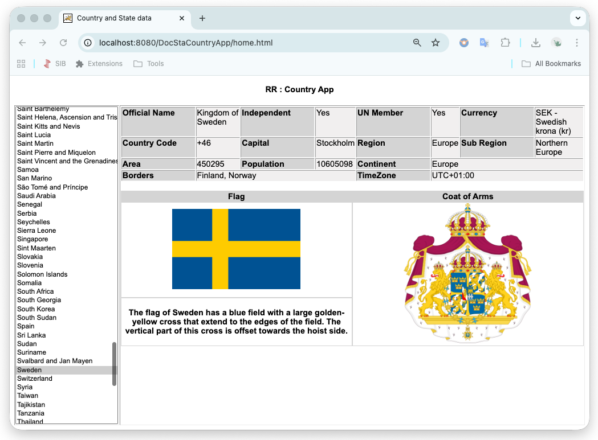

# Country Information App

A web application that displays detailed information about every country in the world, powered by the REST Countries public API. Select any country from the list to instantly view its official details, flag, and coat of arms.



## Live Demo

This project is hosted via GitHub Pages:

**[View Live Demo](https://rajesh-rajan-dev.github.io/country-information-app/home.html)**

---

## Features

- Full list of all countries loaded dynamically from a public REST API
- Alphabetically sorted country dropdown using JavaScript array sort
- Detailed country data displayed on selection:
  - Official Name, Independence status, UN Membership
  - Currency (code, name, and symbol)
  - Country calling code, Capital city
  - Region, Sub-region, Continent
  - Area (km²) and Population
  - Bordering countries (resolved from country codes to full names)
  - Time zones
  - National Flag (image with alt text description)
  - Coat of Arms (image)
- Asynchronous border country resolution using JavaScript Promises
- Clean, responsive table layout

---

## Project Structure

```
country-information-app/
│
├── home.html           # Main HTML structure and layout
├── styles.css          # Styling — layout, colours, table formatting
├── country_script.js   # All application logic (API calls, DOM updates)
├── screenshot.png      # Application screenshot
└── README.md           # Project documentation
```

---

## Technologies Used

| Technology | Purpose |
|---|---|
| HTML5 | Page structure and semantic layout |
| CSS3 | Styling, table layout, responsive design |
| JavaScript (ES6) | Application logic, API integration, DOM manipulation |
| jQuery 3.6.0 | AJAX requests, DOM selection, event handling |
| REST Countries API | Country data source (v3.1) |

---

## How It Works

### 1. Country List Loading

On page load, the app calls the REST Countries API to fetch all country names:

```
GET https://restcountries.com/v3.1/all?fields=name
```

The response is sorted alphabetically by common name and rendered into a `<select>` dropdown using jQuery.

### 2. Country Detail Fetching

When a user selects a country, the app calls:

```
GET https://restcountries.com/v3.1/name/{countryName}?fullText=true
```

The response JSON is parsed and individual fields are injected into the HTML table cells using jQuery's `.text()` and `.append()` methods.

### 3. Border Country Resolution

Border countries are returned from the API as 3-letter country codes (e.g. `FIN`, `NOR`). The app resolves each code to a full country name using:

```
GET https://restcountries.com/v3.1/alpha/{code}
```

Each lookup is wrapped in a JavaScript `Promise`, and `Promise.all()` is used to wait for all border lookups to complete before updating the UI. This ensures the borders field is always accurate and complete.

```javascript
Promise.all(promises).then(function(countryNames) {
    border_countries = countryNames.filter(Boolean).join(", ");
    callback(border_countries);
});
```

### 4. Dynamic Image Rendering

Flag and Coat of Arms images are created as `` elements in JavaScript and appended to their respective table cells. The flag's alt text description (where available from the API) is displayed below the flag image.

---

## How to Run Locally

No build tools or installation required. Simply open the HTML file in a browser:

```bash
# Clone the repository
git clone https://github.com/rajesh-rajan-dev/country-information-app.git

# Open in browser
open home.html
```

Alternatively, use a local development server to avoid CORS issues:

```bash
# Using Python
python3 -m http.server 8080

# Then open
http://localhost:8080/home.html
```

---

## API Reference

This project uses the [REST Countries API](https://restcountries.com) — a free, open-source API providing data for all countries.

**Endpoints used:**

| Endpoint | Purpose |
|---|---|
| `/v3.1/all?fields=name` | Fetch all country names for the dropdown |
| `/v3.1/name/{name}?fullText=true` | Fetch full details for a selected country |
| `/v3.1/alpha/{code}` | Resolve a 3-letter country code to a country name |

---

## Key JavaScript Concepts Demonstrated

- **AJAX with jQuery** — `$.ajax()` for all API calls with success and error handling
- **Promises and async resolution** — `Promise.all()` for parallel border country lookups
- **Array sorting** — `Array.sort()` with `localeCompare()` for alphabetical ordering
- **Dynamic DOM manipulation** — creating, configuring, and appending elements at runtime
- **Event handling** — `$.on("change")` for responsive dropdown interaction
- **Callback pattern** — used for asynchronous border name resolution
- **Data transformation** — mapping API JSON fields to UI elements

---

## Sample API Response (excerpt)

```json
{
  "name": {
    "common": "Sweden",
    "official": "Kingdom of Sweden"
  },
  "idd": { "root": "+4", "suffixes": ["6"] },
  "capital": ["Stockholm"],
  "region": "Europe",
  "subregion": "Northern Europe",
  "currencies": {
    "SEK": { "name": "Swedish krona", "symbol": "kr" }
  },
  "borders": ["FIN", "NOR"],
  "area": 450295,
  "population": 10605098,
  "flags": {
    "png": "https://flagcdn.com/w320/se.png",
    "alt": "The flag of Sweden has a blue field..."
  }
}
```

---

## Author

**Rajesh Rajan**
Senior Java Backend Engineer | Stockholm, Sweden
[LinkedIn](https://www.linkedin.com/in/rajesh-rajan-358247100/) | [GitHub](https://github.com/rajesh-rajan-dev)

---

*This project is part of a broader portfolio demonstrating full-stack development capabilities alongside Java backend engineering.*
